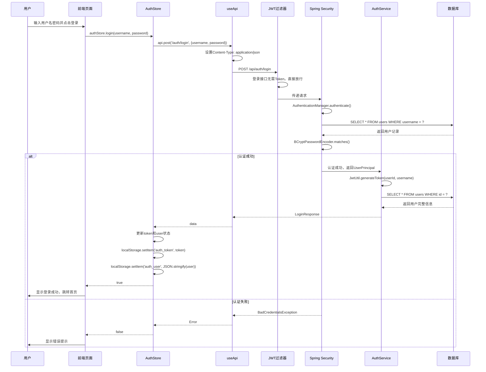
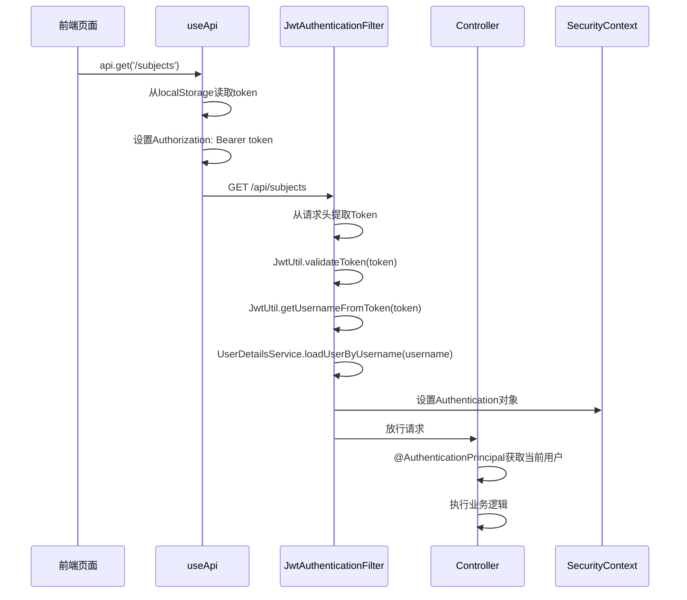
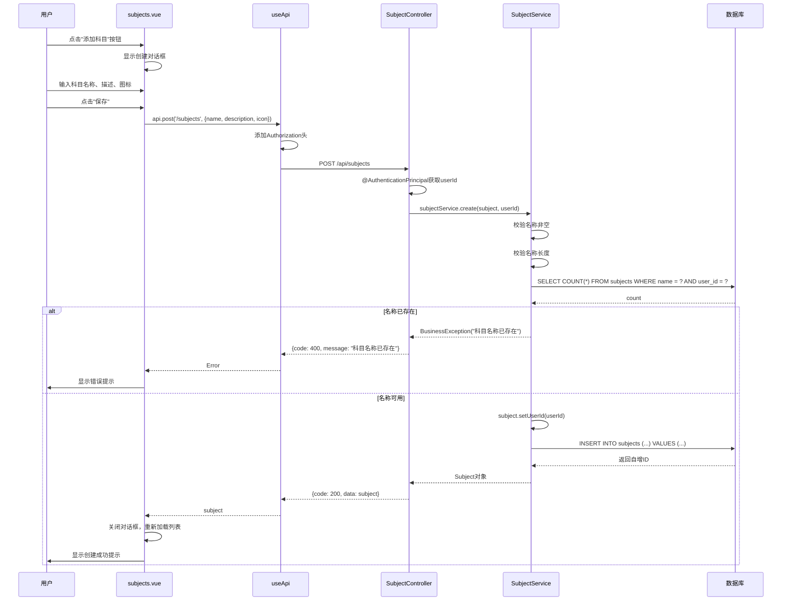
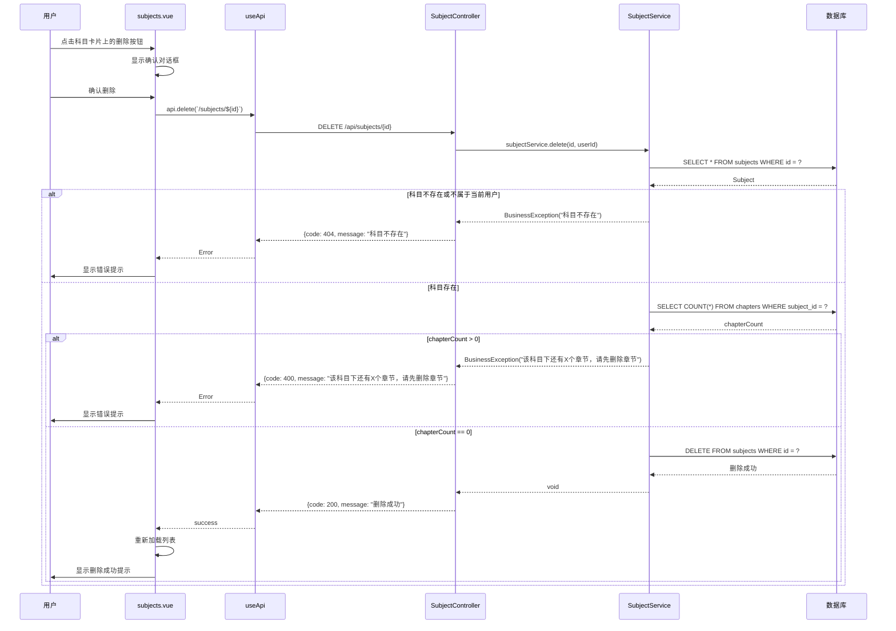
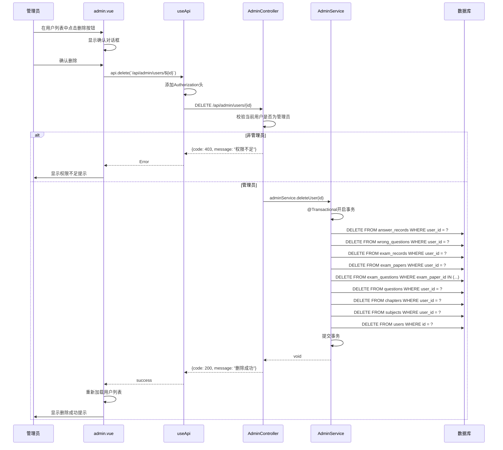
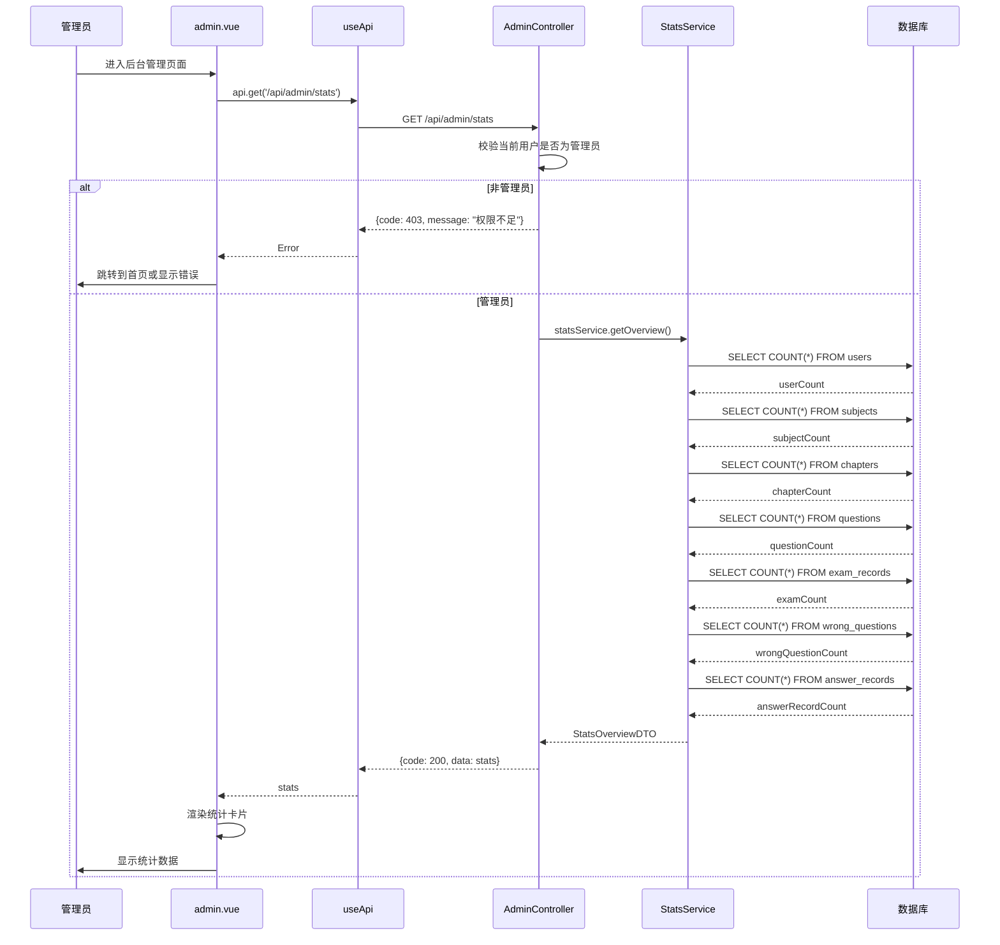

# 期末复习刷题系统 - 模块功能详细设计

## 目录

1. [基础模块](#一基础模块)
   - 1.1 模块概述
   - 1.2 功能需求分析
   - 1.3 功能详细设计
   - 1.4 数据结构设计
   - 1.5 API接口设计
   - 1.6 业务流程

2. [科目章节模块](#二科目章节模块)
   - 2.1 模块概述
   - 2.2 功能需求分析
   - 2.3 功能详细设计
   - 2.4 数据结构设计
   - 2.5 API接口设计
   - 2.6 业务流程

3. [后台管理模块](#三后台管理模块)
   - 3.1 模块概述
   - 3.2 功能需求分析
   - 3.3 功能详细设计
   - 3.4 数据结构设计
   - 3.5 API接口设计
   - 3.6 业务流程

---

## 一、基础模块

### 1.1 模块概述

**模块定位**：基础模块是系统的核心基础设施，负责用户认证、授权和安全管理。

**核心职责**：
- 用户注册与登录
- JWT Token管理
- 权限控制
- 密码安全处理

**技术栈**：
- Spring Security 6.x
- JWT (jjwt 0.12.5)
- BCryptPasswordEncoder

---

### 1.2 功能需求分析

| 需求编号 | 需求描述 | 需求来源 |
| :--- | :--- | :--- |
| BA-001 | 用户可以通过用户名和密码进行登录 | 系统安全性需求 |
| BA-002 | 用户可以注册新账号（用户名、密码、昵称） | 系统可用性需求 |
| BA-003 | 用户登录后可以获取当前登录用户信息 | 前端展示需求 |
| BA-004 | 用户可以修改密码 | 账户安全需求 |
| BA-005 | 用户可以退出登录 | 账户安全需求 |
| BA-006 | 系统支持管理员和普通用户两种角色 | 权限管理需求 |
| BA-007 | JWT Token有效期为24小时 | 安全性与可用性平衡 |
| BA-008 | 登录状态持久化（页面刷新后保持登录） | 用户体验需求 |

---

### 1.3 功能详细设计

#### 1.3.1 用户登录

**功能描述**：用户输入用户名和密码，系统验证身份后返回JWT Token

**处理流程**：
1. 前端收集用户输入的用户名和密码
2. 调用登录接口 `/api/auth/login`
3. 后端验证用户名是否存在
4. 使用BCrypt验证密码正确性
5. 生成JWT Token（包含userId和username）
6. 返回Token和用户信息
7. 前端将Token存储到localStorage

**业务规则**：
- 用户名和密码不能为空
- 密码使用BCrypt加密存储，不可逆向解密
- 连续失败登录5次后账号锁定15分钟（可选扩展）

#### 1.3.2 用户注册

**功能描述**：新用户创建账号

**处理流程**：
1. 前端收集用户名、密码、昵称
2. 调用注册接口 `/api/auth/register`
3. 后端校验用户名唯一性
4. 使用BCrypt加密密码
5. 插入用户记录到数据库
6. 自动生成JWT Token并返回

**业务规则**：
- 用户名长度3-50字符
- 密码长度6-50字符
- 用户名不可重复

#### 1.3.3 获取当前用户信息

**功能描述**：获取当前登录用户的详细信息

**处理流程**：
1. 前端携带Authorization头（Bearer Token）
2. 调用 `/api/auth/me`
3. JWT过滤器解析Token
4. 从数据库查询用户信息
5. 返回用户详情

**业务规则**：
- 必须携带有效的JWT Token
- 只能获取当前用户的信息

#### 1.3.4 修改密码

**功能描述**：用户修改登录密码

**处理流程**：
1. 前端收集原密码和新密码
2. 调用 `/api/auth/password`
3. 验证原密码正确性
4. 使用BCrypt加密新密码
5. 更新数据库中的密码

**业务规则**：
- 原密码必须正确
- 新密码长度6-50字符
- 新密码不能与原密码相同（可选）

#### 1.3.5 用户退出登录

**功能描述**：清除用户登录状态

**处理流程**：
1. 前端调用退出方法
2. 清除Pinia store中的token和user
3. 删除localStorage中的auth_token和auth_user
4. 跳转到登录页面

**业务规则**：
- 清除本地所有登录相关数据

---

### 1.4 数据结构设计

#### 1.4.1 用户实体（User）

| 字段名 | 类型 | 约束 | 说明 |
| :--- | :--- | :--- | :--- |
| id | BIGINT | PRIMARY KEY, AUTO_INCREMENT | 用户唯一标识 |
| username | VARCHAR(50) | NOT NULL, UNIQUE | 登录用户名 |
| password | VARCHAR(255) | NOT NULL | BCrypt加密后的密码 |
| nickname | VARCHAR(50) | DEFAULT '' | 用户昵称（展示用） |
| avatar | VARCHAR(255) | DEFAULT '' | 头像URL |
| role | VARCHAR(20) | DEFAULT 'user' | 用户角色（user/admin） |
| created_at | DATETIME | DEFAULT CURRENT_TIMESTAMP | 创建时间 |
| updated_at | DATETIME | ON UPDATE CURRENT_TIMESTAMP | 更新时间 |

#### 1.4.2 登录请求（LoginRequest）

| 字段名 | 类型 | 约束 | 说明 |
| :--- | :--- | :--- | :--- |
| username | String | @NotBlank | 用户名 |
| password | String | @NotBlank | 密码 |

#### 1.4.3 注册请求（RegisterRequest）

| 字段名 | 类型 | 约束 | 说明 |
| :--- | :--- | :--- | :--- |
| username | String | @NotBlank, @Size(min=3, max=50) | 用户名 |
| password | String | @NotBlank, @Size(min=6, max=50) | 密码 |
| nickname | String | @Size(max=50) | 昵称（可选） |

#### 1.4.4 登录响应（LoginResponse）

| 字段名 | 类型 | 说明 |
| :--- | :--- | :--- |
| token | String | JWT Token |
| userId | Long | 用户ID |
| username | String | 用户名 |
| nickname | String | 用户昵称 |
| role | String | 用户角色 |

#### 1.4.5 修改密码请求（ChangePasswordDTO）

| 字段名 | 类型 | 约束 | 说明 |
| :--- | :--- | :--- | :--- |
| oldPassword | String | @NotBlank | 原密码 |
| newPassword | String | @NotBlank, @Size(min=6, max=50) | 新密码 |

---

### 1.5 API接口设计

#### 1.5.1 登录接口

| 属性 | 值 |
| :--- | :--- |
| **URL** | `POST /api/auth/login` |
| **认证** | 无需认证 |
| **请求体** | `LoginRequest` |
| **成功响应** | `200 OK { code: 200, data: LoginResponse, message: "登录成功" }` |
| **失败响应** | `400 Bad Request { code: 400, message: "用户名或密码错误" }` |

#### 1.5.2 注册接口

| 属性 | 值 |
| :--- | :--- |
| **URL** | `POST /api/auth/register` |
| **认证** | 无需认证 |
| **请求体** | `RegisterRequest` |
| **成功响应** | `200 OK { code: 200, data: LoginResponse, message: "注册成功" }` |
| **失败响应** | `400 Bad Request { code: 400, message: "用户名已存在" }` |

#### 1.5.3 获取当前用户信息

| 属性 | 值 |
| :--- | :--- |
| **URL** | `GET /api/auth/me` |
| **认证** | 需要JWT Token |
| **请求头** | `Authorization: Bearer <token>` |
| **成功响应** | `200 OK { code: 200, data: LoginResponse }` |
| **失败响应** | `401 Unauthorized { code: 401, message: "请先登录" }` |

#### 1.5.4 修改密码

| 属性 | 值 |
| :--- | :--- |
| **URL** | `PUT /api/auth/password` |
| **认证** | 需要JWT Token |
| **请求体** | `ChangePasswordDTO` |
| **成功响应** | `200 OK { code: 200, message: "密码修改成功" }` |
| **失败响应** | `400 Bad Request { code: 400, message: "原密码错误" }` |

---

### 1.6 业务流程

#### 1.6.1 登录流程



#### 1.6.2 认证流程（后续请求）



---

## 二、科目章节模块

### 2.1 模块概述

**模块定位**：科目章节模块负责管理学习科目和章节的组织结构。

**核心职责**：
- 科目管理（增删改查）
- 章节管理（增删改查）
- 数据隔离（用户只能访问自己的数据）
- 排序管理

**技术栈**：
- Spring Boot 3.2.5
- MyBatis-Plus
- Element Plus（前端）

---

### 2.2 功能需求分析

| 需求编号 | 需求描述 | 需求来源 |
| :--- | :--- | :--- |
| SC-001 | 用户可以创建学习科目 | 学习组织需求 |
| SC-002 | 用户可以查看自己的科目列表 | 学习导航需求 |
| SC-003 | 用户可以编辑科目信息 | 信息维护需求 |
| SC-004 | 用户可以删除科目 | 信息维护需求 |
| SC-005 | 用户可以在科目下创建章节 | 知识点组织需求 |
| SC-006 | 用户可以查看科目下的章节列表 | 学习导航需求 |
| SC-007 | 用户可以编辑章节信息 | 信息维护需求 |
| SC-008 | 用户可以删除章节 | 信息维护需求 |
| SC-009 | 删除科目前需检查是否有关联章节 | 数据完整性需求 |
| SC-010 | 删除章节前需检查是否有关联题目 | 数据完整性需求 |
| SC-011 | 章节自动排序 | 用户体验需求 |
| SC-012 | 管理员可以查看所有用户的科目和章节 | 管理需求 |

---

### 2.3 功能详细设计

#### 2.3.1 创建科目

**功能描述**：用户创建新的学习科目

**处理流程**：
1. 前端收集科目名称、描述、图标
2. 调用 `/api/subjects` POST接口
3. 后端校验名称非空且长度不超过50字符
4. 检查同名科目是否存在（当前用户范围内）
5. 设置科目所属用户ID
6. 插入数据库

**业务规则**：
- 科目名称必填，最大50字符
- 同一用户下科目名称不可重复
- 描述和图标为可选字段

#### 2.3.2 获取科目列表

**功能描述**：获取用户的科目列表

**处理流程**：
1. 前端调用 `/api/subjects` GET接口
2. JWT过滤器解析Token获取用户ID
3. 根据用户角色查询科目
   - 普通用户：只查询自己的科目
   - 管理员：查询所有科目
4. 按sort_order升序排序
5. 返回科目列表

**业务规则**：
- 普通用户只能查看自己创建的科目
- 管理员可以查看所有科目

#### 2.3.3 更新科目

**功能描述**：修改已有科目信息

**处理流程**：
1. 前端收集修改后的科目信息
2. 调用 `/api/subjects/{id}` PUT接口
3. 后端校验科目存在且属于当前用户
4. 检查同名科目（排除自身）
5. 更新数据库记录

**业务规则**：
- 只能修改自己创建的科目
- 名称唯一性校验时排除自身

#### 2.3.4 删除科目

**功能描述**：删除指定科目

**处理流程**：
1. 前端确认删除操作
2. 调用 `/api/subjects/{id}` DELETE接口
3. 后端校验科目存在且属于当前用户
4. 检查是否有关联章节
5. 如果有章节，拒绝删除并提示
6. 如果无章节，执行删除

**业务规则**：
- 只能删除自己创建的科目
- 科目下有章节时不能删除

#### 2.3.5 创建章节

**功能描述**：在指定科目下创建章节

**处理流程**：
1. 前端选择科目并输入章节名称
2. 调用 `/api/chapters` POST接口
3. 后端校验科目存在且属于当前用户
4. 查询该科目下最大sort_order
5. 设置新章节sort_order = 最大值 + 1（或1）
6. 设置章节所属用户ID
7. 插入数据库

**业务规则**：
- 章节名称必填
- 自动分配排序号

#### 2.3.6 获取章节列表

**功能描述**：获取指定科目下的章节列表

**处理流程**：
1. 前端调用 `/api/chapters?subjectId={id}` GET接口
2. 后端校验科目存在且属于当前用户
3. 查询该科目下的所有章节
4. 按sort_order升序排序
5. 返回章节列表

**业务规则**：
- 只能查看自己科目下的章节

#### 2.3.7 更新章节

**功能描述**：修改章节信息

**处理流程**：
1. 前端收集修改后的章节名称
2. 调用 `/api/chapters/{id}` PUT接口
3. 后端校验章节存在且属于当前用户
4. 更新数据库记录

**业务规则**：
- 只能修改自己创建的章节

#### 2.3.8 删除章节

**功能描述**：删除指定章节

**处理流程**：
1. 前端确认删除操作
2. 调用 `/api/chapters/{id}` DELETE接口
3. 后端校验章节存在且属于当前用户
4. 检查是否有关联题目和错题记录
5. 如果有，拒绝删除并提示
6. 如果无，执行删除

**业务规则**：
- 只能删除自己创建的章节
- 章节下有题目或错题时不能删除

---

### 2.4 数据结构设计

#### 2.4.1 科目实体（Subject）

| 字段名 | 类型 | 约束 | 说明 |
| :--- | :--- | :--- | :--- |
| id | INT | PRIMARY KEY, AUTO_INCREMENT | 科目唯一标识 |
| name | VARCHAR(50) | NOT NULL | 科目名称 |
| description | VARCHAR(200) | DEFAULT '' | 科目描述 |
| icon | VARCHAR(100) | DEFAULT '' | 科目图标（emoji） |
| sort_order | INT | DEFAULT 0 | 排序号 |
| user_id | BIGINT | DEFAULT 0 | 所属用户ID |
| created_at | DATETIME | DEFAULT CURRENT_TIMESTAMP | 创建时间 |

#### 2.4.2 章节实体（Chapter）

| 字段名 | 类型 | 约束 | 说明 |
| :--- | :--- | :--- | :--- |
| id | INT | PRIMARY KEY, AUTO_INCREMENT | 章节唯一标识 |
| subject_id | INT | NOT NULL, FOREIGN KEY | 所属科目ID |
| name | VARCHAR(100) | NOT NULL | 章节名称 |
| sort_order | INT | DEFAULT 0 | 排序号 |
| user_id | BIGINT | DEFAULT 0 | 所属用户ID |
| created_at | DATETIME | DEFAULT CURRENT_TIMESTAMP | 创建时间 |

---

### 2.5 API接口设计

#### 2.5.1 科目管理接口

| API | 方法 | 认证 | 说明 |
| :--- | :--- | :--- | :--- |
| `/api/subjects` | POST | 需要Token | 创建科目 |
| `/api/subjects` | GET | 需要Token | 获取科目列表 |
| `/api/subjects/{id}` | GET | 需要Token | 获取单个科目 |
| `/api/subjects/{id}` | PUT | 需要Token | 更新科目 |
| `/api/subjects/{id}` | DELETE | 需要Token | 删除科目 |

**创建科目请求体**：
```json
{
  "name": "高等数学",
  "description": "大学数学基础课程",
  "icon": "📐"
}
```

**科目响应体**：
```json
{
  "code": 200,
  "data": {
    "id": 1,
    "name": "高等数学",
    "description": "大学数学基础课程",
    "icon": "📐",
    "sortOrder": 0,
    "userId": 1,
    "createdAt": "2026-06-15T10:30:00"
  }
}
```

#### 2.5.2 章节管理接口

| API | 方法 | 认证 | 说明 |
| :--- | :--- | :--- | :--- |
| `/api/chapters` | POST | 需要Token | 创建章节 |
| `/api/chapters` | GET | 需要Token | 获取章节列表（按科目筛选） |
| `/api/chapters/{id}` | GET | 需要Token | 获取单个章节 |
| `/api/chapters/{id}` | PUT | 需要Token | 更新章节 |
| `/api/chapters/{id}` | DELETE | 需要Token | 删除章节 |

**创建章节请求体**：
```json
{
  "name": "第一章 函数与极限",
  "subjectId": 1
}
```

**章节响应体**：
```json
{
  "code": 200,
  "data": {
    "id": 1,
    "subjectId": 1,
    "name": "第一章 函数与极限",
    "sortOrder": 1,
    "userId": 1,
    "createdAt": "2026-06-15T10:35:00"
  }
}
```

---

### 2.6 业务流程

#### 2.6.1 创建科目流程



#### 2.6.2 删除科目流程



---

## 三、后台管理模块

### 3.1 模块概述

**模块定位**：后台管理模块为管理员提供系统级别的管理功能。

**核心职责**：
- 用户管理（查看、删除用户）
- 系统统计数据展示
- 数据清理和维护

**技术栈**：
- Spring Boot 3.2.5
- Element Plus（前端）

---

### 3.2 功能需求分析

| 需求编号 | 需求描述 | 需求来源 |
| :--- | :--- | :--- |
| AD-001 | 管理员可以查看所有用户列表 | 管理需求 |
| AD-002 | 管理员可以查看用户详情 | 管理需求 |
| AD-003 | 管理员可以删除用户（级联删除所有关联数据） | 管理需求 |
| AD-004 | 管理员可以查看系统统计数据 | 运营需求 |
| AD-005 | 统计数据包括：用户数、科目数、题目数、考试数、错题数、答题记录数 | 运营需求 |
| AD-006 | 普通用户无法访问后台管理页面 | 权限需求 |

---

### 3.3 功能详细设计

#### 3.3.1 获取用户列表

**功能描述**：管理员查看系统中的所有用户

**处理流程**：
1. 前端调用 `/api/admin/users` GET接口
2. 后端校验当前用户是否为管理员
3. 查询所有用户（分页）
4. 返回用户列表

**业务规则**：
- 只有管理员可以访问
- 支持分页查询

#### 3.3.2 删除用户

**功能描述**：管理员删除指定用户及其所有关联数据

**处理流程**：
1. 前端确认删除操作
2. 调用 `/api/admin/users/{id}` DELETE接口
3. 后端校验当前用户是否为管理员
4. 开启事务
5. 级联删除：答题记录 → 错题本 → 考试记录 → 试卷 → 题目 → 章节 → 科目 → 用户
6. 提交事务

**业务规则**：
- 只有管理员可以删除用户
- 使用事务保证数据完整性
- 删除用户会级联删除所有关联数据

#### 3.3.3 获取系统统计

**功能描述**：获取系统各项统计数据

**处理流程**：
1. 前端调用 `/api/admin/stats` GET接口
2. 后端校验当前用户是否为管理员
3. 查询各表记录数
4. 返回统计数据

**业务规则**：
- 只有管理员可以访问

---

### 3.4 数据结构设计

#### 3.4.1 统计数据响应（StatsOverviewDTO）

| 字段名 | 类型 | 说明 |
| :--- | :--- | :--- |
| userCount | Long | 用户总数 |
| subjectCount | Long | 科目总数 |
| chapterCount | Long | 章节总数 |
| questionCount | Long | 题目总数 |
| examCount | Long | 考试记录数 |
| wrongQuestionCount | Long | 错题总数 |
| answerRecordCount | Long | 答题记录总数 |

---

### 3.5 API接口设计

#### 3.5.1 用户管理接口

| API | 方法 | 认证 | 说明 |
| :--- | :--- | :--- | :--- |
| `/api/admin/users` | GET | 需要Token（管理员） | 获取用户列表 |
| `/api/admin/users/{id}` | GET | 需要Token（管理员） | 获取单个用户 |
| `/api/admin/users/{id}` | DELETE | 需要Token（管理员） | 删除用户 |

**用户列表响应**：
```json
{
  "code": 200,
  "data": {
    "list": [
      {
        "id": 1,
        "username": "admin",
        "nickname": "管理员",
        "role": "admin",
        "createdAt": "2026-06-01T08:00:00"
      }
    ],
    "total": 100
  }
}
```

#### 3.5.2 统计接口

| API | 方法 | 认证 | 说明 |
| :--- | :--- | :--- | :--- |
| `/api/admin/stats` | GET | 需要Token（管理员） | 获取系统统计数据 |

**统计响应**：
```json
{
  "code": 200,
  "data": {
    "userCount": 100,
    "subjectCount": 500,
    "chapterCount": 2000,
    "questionCount": 10000,
    "examCount": 500,
    "wrongQuestionCount": 2000,
    "answerRecordCount": 50000
  }
}
```

---

### 3.6 业务流程

#### 3.6.1 删除用户流程（级联删除）



#### 3.6.2 获取系统统计流程



---

## 附录：权限控制规则

### 角色定义

| 角色 | 说明 | 权限 |
| :--- | :--- | :--- |
| user | 普通用户 | 只能访问自己创建的数据 |
| admin | 管理员 | 可以访问和管理所有数据 |

### 权限控制实现

```mermaid
graph TD
    A[请求到达] --> B[JWT过滤器解析Token]
    B --> C[设置SecurityContext]
    C --> D[Controller接收请求]
    D --> E[SecurityUtil.isAdmin()]
    
    E --> F{是否为管理员?}
    F -->|是| G[查询所有数据]
    F -->|否| H[查询当前用户数据]
    
    G --> I[返回结果]
    H --> I
    
    style A fill:#e1f5ff
    style C fill:#c8e6c9
    style G fill:#fff9c4
    style H fill:#fff9c4
    style I fill:#e8f5e9
```

**代码实现示例**：
```java
// Service层数据隔离逻辑
public List<Subject> getAll(Long userId) {
    return subjectMapper.selectList(
        new LambdaQueryWrapper<Subject>()
            .eq(!SecurityUtil.isAdmin(), Subject::getUserId, userId)
            .orderByAsc(Subject::getSortOrder)
    );
}
```